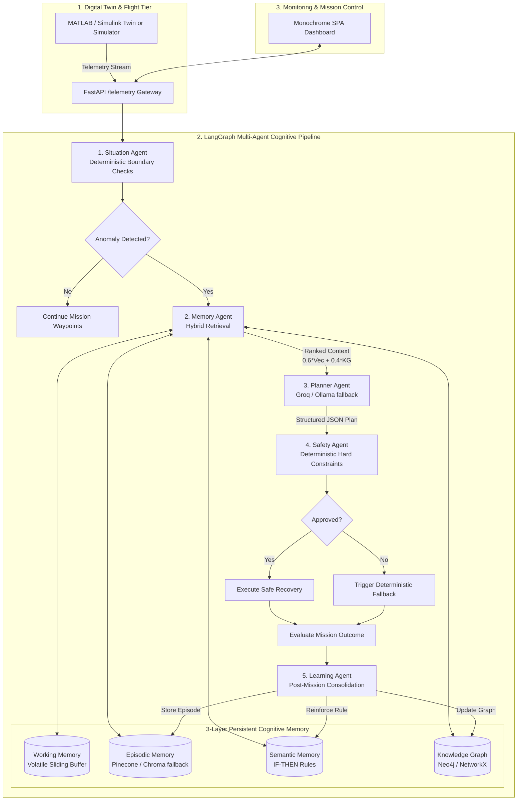

# AeroCortex: An Experience-Aware Cognitive Memory Architecture for Autonomous Edge UAVs

[](https://www.python.org/downloads/)
[](https://github.com/langchain-ai/langgraph)
[](https://www.pinecone.io/)
[](https://neo4j.com/)
[](https://groq.com/)
[](https://www.raspberrypi.com/products/raspberry-pi-5/)
[]()

AeroCortex is a complete, production-grade cognitive memory and recovery architecture designed for autonomous Unmanned Aerial Vehicles (UAVs). The REST API is meant to run with internet access (Groq + Pinecone + Atlas + Aura). Ollama and Chroma are automatic fallbacks for Raspberry Pi / offline edge.

When encountering in-flight anomalies (GPS interference, rapid battery sag, communication dropout, severe wind gusts, sensor divergence, or compound failures), AeroCortex:
1. **Detects anomalies deterministically** (< 1ms threshold engine; no LLM hallucinations for basic detection).
2. **Retrieves relevant past mission experiences** via **Hybrid Memory Retrieval** (Pinecone semantic vectors with Chroma fallback + Neo4j / NetworkX relational Knowledge Graph + Semantic IF-THEN rules).
3. **Reasons over recovery options** using **Groq** (with Ollama on Raspberry Pi when Groq is unreachable, then an offline cognitive reasoner).
4. **Validates all recovery plans through a mandatory deterministic Safety Agent** enforcing hard aerodynamic, electrical, and spatial constraints.
5. **Executes safe recovery or deterministic fail-safe fallbacks**.
6. **Learns continually across missions** by indexing outcomes, reinforcing operational rules, and updating the Knowledge Graph for superior future recall.

---

## 1. System Architecture



---

## 2. Project Directory Layout

```
aerocortex/
├── config/
│   ├── config.yaml               # Flight envelope limits, memory weights, model settings
│   └── settings.py               # Pydantic strongly-typed configuration loader
├── agents/
│   ├── situation_agent.py        # Deterministic telemetry anomaly detector & classifier
│   ├── memory_agent.py           # Hybrid retriever (0.6*vector + 0.4*graph)
│   ├── planner_agent.py          # Groq recovery planner with Ollama + reasoner fallback
│   ├── safety_agent.py           # Deterministic safety constraint validator & gatekeeper
│   └── learning_agent.py         # Experience consolidation, Pinecone/Chroma & KG rule update
├── memory/
│   ├── working_memory.py         # Fast in-memory state store for active mission
│   ├── episodic_memory.py        # Experience vector store & semantic similarity
│   ├── semantic_memory.py        # Structured IF-THEN operational knowledge base
│   ├── vector_store.py           # Pinecone primary + Chroma fallback + offline embeddings
│   └── knowledge_graph.py        # Neo4j client + offline NetworkX embedded fallback graph
├── simulation/
│   ├── telemetry_generator.py    # 6-DOF dynamic UAV telemetry generator
│   ├── failure_scenarios.py      # 8 realistic simulated failure modes
│   └── mission_simulator.py      # Full mission simulation runner & coordinator
├── llm/
│   ├── groq_client.py            # Groq chat client (REST primary)
│   └── ollama_client.py          # Ollama Gemma 3 client + offline cognitive reasoner fallback
├── orchestration/
│   ├── state.py                  # LangGraph AeroCortexState TypedDict
│   └── graph.py                  # LangGraph StateGraph pipeline with conditional routing
├── safety/
│   ├── constraints.py            # Safety constraints (battery, altitude, wind, GPS, geofence)
│   └── fallback.py               # Deterministic fallback procedures (VIO, RTH, emergency land)
├── api/
│   └── telemetry_api.py          # FastAPI application with all 6 required endpoints
├── dashboard/
│   ├── server.py                 # FastAPI host for Minimalist Monochrome SPA
│   └── static/                   # HTML / CSS / JS live mission control
├── docs/
│   └── VERCEL.md                 # Deploy SPA to Vercel (proxy to Render API)
├── scripts/
│   └── vercel-prepare.js         # Copies dashboard/static → public for Vercel
├── vercel.json                   # Vercel build + /api rewrites to Render
├── data/
│   ├── missions/                 # Evaluation reports and mission outcome logs
│   └── knowledge/                # Default semantic rules, knowledge graph seeds, ChromaDB storage
├── matlab/
│   ├── aerocortex_telemetry_sender.m # MATLAB script for digital twin streaming
│   └── README.md                 # MATLAB integration protocol & data format spec
├── tests/                        # 44 comprehensive unit and integration tests
├── docker-compose.yml            # Neo4j, Ollama, API, and Dashboard container definitions
├── Dockerfile                    # Container build file
├── .env.example                  # Environment configuration template
├── requirements.txt              # Python production dependencies
├── pyproject.toml                # Build packaging metadata
├── demo.py                       # One-command CLI demonstration (Section 28)
├── evaluate.py                   # Repeatable benchmark evaluation (Sections 21 & 22)
└── main.py                       # Unified entry point for API, simulator, or demo
```

---

## 3. UAV Telemetry Schema

Validated via Pydantic model (`UAVTelemetry`):

| Field | Type | Description | Example |
| :--- | :--- | :--- | :--- |
| `timestamp` | `float` | POSIX timestamp in seconds | `1726500000.0` |
| `mission_id` | `str` | Unique flight mission identifier | `"MISSION_001"` |
| `latitude` | `float` | WGS84 Latitude (degrees) | `11.0168` |
| `longitude` | `float` | WGS84 Longitude (degrees) | `76.9558` |
| `altitude` | `float` | Altitude Above Ground Level (meters) | `120.0` |
| `velocity` | `float` | Ground velocity (m/s) | `12.5` |
| `battery_level` | `float` | State of charge (0.0 to 100.0%) | `72.0` |
| `battery_voltage`| `float`| Bus voltage (Volts) | `15.4` |
| `gps_status` | `str` | `"healthy"`, `"degraded"`, `"lost"` | `"healthy"` |
| `gps_accuracy` | `float`| Horizontal Dilution of Precision (HDOP, m) | `1.8` |
| `imu_acceleration`| `list` | 3-axis accelerometer `[ax, ay, az]` (m/s²) | `[0.0, 0.0, 9.81]` |
| `imu_gyroscope` | `list` | 3-axis angular rates `[gx, gy, gz]` (rad/s)| `[0.0, 0.0, 0.0]` |
| `wind_speed` | `float` | Ambient horizontal wind speed (m/s) | `7.2` |
| `wind_direction` | `float`| Wind azimuth (0 to 360 degrees) | `180.0` |
| `communication_status`| `str`| `"connected"`, `"degraded"`, `"lost"`| `"connected"` |
| `mission_state` | `str` | `"CRUISE"`, `"WAYPOINT_NAV"`, `"HOVER"`, `"RTH"` | `"CRUISE"` |
| `waypoint` | `int` | Active target waypoint sequence | `3` |
| `heading` | `float`| Drone yaw heading (degrees) | `90.0` |
| `payload_status` | `str` | `"nominal"`, `"jettisoned"`, `"error"` | `"nominal"` |

---

## 4. The 8 Simulated Failure Scenarios

1. **GPS Interference**: `gps_status = "degraded"`, `gps_accuracy = 6.4m` (HDOP spike), velocity deviation.
2. **GPS Complete Loss**: `gps_status = "lost"`, `gps_accuracy = 99.9m`.
3. **Battery Degradation**: `battery_voltage` rapidly drops below 13.8V under cruise load.
4. **Low Battery**: `battery_level` drops to 13.5% (< 15% safety limit).
5. **Communication Loss**: `communication_status = "lost"`.
6. **Strong Wind**: `wind_speed = 16.8 m/s` (> 12 m/s maximum tolerance), heading drift.
7. **Sensor Anomaly**: IMU accelerometer (`> 30 m/s²`) and gyroscope spikes.
8. **Multiple Simultaneous Failures**: Combined GPS interference + high wind shear.

---

## 5. Quickstart & Installation

### Option A: Local Virtual Environment (Recommended)

```bash
# 1. Clone repository & enter directory
git clone https://github.com/aerocortex/aerocortex.git
cd aerocortex

# 2. Create and activate Python 3.11 virtual environment
python -m venv .venv
# On Windows:
.venv\Scripts\activate
# On Linux/macOS:
source .venv/bin/activate

# 3. Install dependencies
pip install -r requirements.txt
```

### Option B: Docker Compose

Copy `.env.example` to `.env`, then:

```bash
docker compose up --build
```

Brings up services (`mongo` healthy first; `ollama` in parallel; then `api` + `dashboard`). Neo4j defaults to **Aura** (not local Docker):

| Service | URL |
|---|---|
| API + Swagger | http://localhost:8000/docs |
| Health | http://localhost:8000/healthz |
| Dashboard | http://localhost:8501 |
| Neo4j | Aura console · `neo4j+s://93dda264.databases.neo4j.io` |
| Ollama | http://localhost:11434 |

Set `NEO4J_URI` / `NEO4J_PASSWORD` in `.env` and on Render to the Aura instance. If Aura is unreachable the API falls back to embedded NetworkX. Pinecone is the REST vector store; Chroma is used only if Pinecone is unset or unreachable.

`GET /healthz` is unauthenticated. Everything else (except `/docs`) requires `X-API-Key`.

### Cloud hosting

**Recommended split:**

| Piece | Host |
|-------|------|
| FastAPI + Mongo / Neo4j / Groq / Pinecone | [Render](https://render.com) (Docker) or Railway |
| FastAPI serverless (DynamoDB / Bedrock / SQS) | [AWS SAM](docs/AWS_DEPLOY.md) |
| Minimalist Monochrome dashboard | [Vercel](https://vercel.com), CloudFront, or local `python main.py --dashboard` |

Cloud data services: [MongoDB Atlas](https://www.mongodb.com/atlas) + [Neo4j AuraDB](https://neo4j.com/cloud/aura-free/) + [Pinecone](https://www.pinecone.io/) + [Groq](https://console.groq.com/).

### Deploy on AWS

See **[docs/AWS_DEPLOY.md](docs/AWS_DEPLOY.md)** for the SAM runbook (API Gateway + Lambda, DynamoDB, S3 snapshots, SQS FIFO learning, Bedrock, CloudFront). Spec: [docs/AWS_INTEGRATION_SPEC.md](docs/AWS_INTEGRATION_SPEC.md). AWS mode is opt-in via env vars; unset defaults keep local Mongo / Chroma / inline learning.

The REST API is designed to run **with internet**. Set `GROQ_API_KEY` and `PINECONE_API_KEY` in `.env`. Create a Pinecone serverless index named `aerocortex-episodes` (dimension **64**, metric **cosine**). Groq is the planner; Ollama is not required in the cloud.

**Ollama + Chroma are Raspberry Pi / offline fallbacks.** If Groq is unreachable the planner uses Ollama, then the deterministic reasoner. If Pinecone is unreachable the vector store uses local Chroma. Do not assume a cloud host can call `localhost:11434`.

#### Local API + dashboard (two terminals)

```bash
# Terminal 1 — REST API (default port from .env, e.g. 8001)
python main.py --api

# Terminal 2 — SPA on :8501 (proxies /api → DASHBOARD_API_URL)
python main.py --dashboard
```

Open `http://localhost:8501`. Keep `DASHBOARD_API_URL=http://127.0.0.1:8001` in `.env` when using the local API.

#### Deploy dashboard to Vercel (API stays on Render)

1. Ensure the API is live on Render (e.g. `https://aerocortex.onrender.com`) with `API_KEY` set.
2. Push this repo to GitHub, then import it at [vercel.com/new](https://vercel.com/new) (Framework: **Other**).
3. Build command / output are already in `vercel.json` (`node scripts/vercel-prepare.js` → `public`).
4. Set Vercel env vars, then redeploy:

| Variable | Value |
|----------|--------|
| `AEROCORTEX_API_URL` | `https://aerocortex.onrender.com` |
| `AEROCORTEX_API_KEY` | same as Render `API_KEY` |

Full walkthrough: [docs/VERCEL.md](docs/VERCEL.md).

---

## 6. Running AeroCortex

### 1. One-Command Interactive Demo (`python demo.py`)
Demonstrates the full closed cognitive loop:
- Mission 1: Cold start GPS failure -> situation detection -> memory search -> local reasoner -> safety validation -> safe recovery execution -> learning consolidation.
- Mission 2: Identical GPS failure -> memory agent retrieves Mission 1's experience (Relevance: 0.832) -> immediate validated recovery.
```bash
python demo.py
```

### 2. Benchmark Evaluation (`python evaluate.py`)
Runs the 5 repeatable experiments comparing the conventional baseline controller against AeroCortex:
```bash
python evaluate.py
```

### 3. Minimalist Monochrome Mission Dashboard
Live SPA that talks to the REST API (health, simulate, memory, reset):
```bash
python main.py --dashboard
```
Open your browser at `http://localhost:8501`. Set `DASHBOARD_API_URL` (default via `/config.json`) to the browser-reachable API, e.g. `http://127.0.0.1:8001`.

### 4. FastAPI Telemetry Gateway
Starts the HTTP REST server for external flight controllers or MATLAB digital twin:
```bash
python main.py --api
```
Interactive Swagger docs are accessible at `http://localhost:8000/docs`.

All agent + memory work happens behind this API. Send telemetry, get a safety-validated recovery plan, and persist experience to Mongo / Pinecone (or Chroma) / Neo4j.

| Method | Path | Auth | What it does |
|---|---|---|---|
| `POST` | `/telemetry` | `X-API-Key` | Run the full LangGraph pipeline (situation → hybrid memory → planner → safety → learning) |
| `POST` | `/simulate` | `X-API-Key` | Inject a failure scenario and run the same pipeline |
| `GET` | `/memory` | `X-API-Key` | Inspect episodic count, semantic rules, knowledge graph |
| `GET` | `/missions?limit=&skip=` | `X-API-Key` | List persisted episodes from Mongo |
| `GET` | `/status` | `X-API-Key` | Working memory + graph engine |
| `GET` | `/healthz` | none | Dependency health (`ok` / `degraded` / `unavailable`) |
| `POST` | `/reset` | `X-API-Key` | Clear working memory and simulator |

```bash
curl -X POST http://localhost:8000/telemetry \
  -H "X-API-Key: change-me-local-dev-key" \
  -H "Content-Type: application/json" \
  -d "{\"mission_id\":\"M1\",\"altitude\":120,\"gps_status\":\"degraded\",\"gps_accuracy\":6.5}"
```

Python SDK (`sdk/client.py`) — install locally, not PyPI:

```bash
pip install -e .
```

```python
from sdk import AeroCortexClient
from models import UAVTelemetry

with AeroCortexClient("http://localhost:8000", api_key="change-me-local-dev-key") as client:
    print(client.health())
    result = client.send_telemetry(UAVTelemetry(mission_id="M1", gps_status="degraded", gps_accuracy=6.5))
    print(result["action"], result["planner_source"], result["persisted"])
```

Copy `.env.example` to `.env`, add Groq and Pinecone keys for the REST API, then `docker compose up --build`. Ollama is optional in compose — if Groq is down the API uses Ollama when present, otherwise `planner_source: "offline_reasoner"`.

---

## 7. LLM Setup (Groq primary, Ollama fallback)

The REST API uses **Groq** (`llama-3.3-70b-versatile` by default). Set `GROQ_API_KEY` from [console.groq.com](https://console.groq.com/).

**Raspberry Pi / offline:** install Ollama and pull a small Gemma model. AeroCortex uses Ollama only when Groq is unreachable.

```bash
# 1. Install Ollama (https://ollama.ai)
# 2. Pull Gemma 3 model:
ollama pull gemma3:latest
# For Raspberry Pi 5 / 4GB devices:
ollama pull gemma:2b

# 3. Start Ollama server:
ollama serve
```

> **Offline Resilience**: If Groq and Ollama are both unreachable, AeroCortex switches to an **Offline Cognitive Reasoner** that synthesizes retrieved hybrid memories and rules deterministically, so UAV flight controls never stall.

---

## 8. Hybrid Memory Retrieval Formulation

To balance vector semantic similarity with relational graph structure, the Memory Agent computes a composite relevance score:

$$\text{Final Score} = w_{\text{vector}} \cdot \text{Similarity}_{\text{Pinecone / Chroma}} + w_{\text{graph}} \cdot \text{Relevance}_{\text{Neo4j}}$$

Default configuration in `config/config.yaml`:
- $w_{\text{vector}} = 0.6$
- $w_{\text{graph}} = 0.4$

---

## 9. MATLAB / Simulink Digital Twin Integration

AeroCortex includes a ready-to-run MATLAB client in `matlab/aerocortex_telemetry_sender.m`.

```matlab
% 1. Start AeroCortex API: python main.py --api
% 2. Open MATLAB and run:
run('matlab/aerocortex_telemetry_sender.m')
```

The script streams 40 flight cycles, injects a simulated GPS failure at step 15, and applies the safety-approved cognitive recovery commands. See [matlab/README.md](matlab/README.md) for data schemas.

---

## 10. Raspberry Pi 5 Edge Deployment Guide

To deploy AeroCortex on a **Raspberry Pi 5 (4GB / 8GB)**:

1. **Lightweight Embedding Engine**: AeroCortex features a built-in deterministic 64-dimensional offline embedding function (`DeterministicOfflineEmbedding`) that runs in pure Python/NumPy, avoiding heavy PyTorch dependencies.
2. **Ollama Quantization**: Use `gemma:2b` (4-bit quantized, ~1.6 GB RAM) for sub-second edge inference when Groq is unreachable.
3. **Embedded Graph Mode**: AeroCortex automatically uses its embedded NetworkX / JSON graph engine, requiring zero Neo4j Docker overhead on edge devices.
4. **Local vectors**: Leave `PINECONE_API_KEY` empty on the Pi so episodic memory stays on Chroma.

---

## 11. Automated Test Suite

AeroCortex includes 44 unit and integration tests covering all subsystems:

```bash
pytest tests -v
```

Test coverage includes:
- `test_telemetry.py`: Pydantic schema validation & boundaries.
- `test_situation.py`: Deterministic detection of all 8 failure modes.
- `test_memory.py`: ChromaDB vector storage, semantic rule matching, and KG paths.
- `test_planner.py`: Planner JSON validation and offline cognitive fallback.
- `test_safety.py`: Flight envelope constraints, low battery / wind overrides.
- `test_learning.py`: Experiential commits and dynamic rule reinforcement.
- `test_workflow.py`: Complete LangGraph state machine execution end-to-end.
- `test_api.py`: FastAPI REST endpoints (`/telemetry`, `/status`, `/memory`, `/simulate`, `/reset`).

---

## 12. Benchmark Evaluation Results

| Experiment | Failure Scenario | Baseline Action | AeroCortex Recovery | Hybrid Relevance | Safety Status |
| :--- | :--- | :--- | :--- | :---: | :---: |
| **EXP-1** | `GPS_INTERFERENCE` | `RETURN_TO_HOME` (Risky without GPS) | `SWITCH_TO_VIO_DEAD_RECKONING` | **0.827** | **APPROVED** |
| **EXP-2** | `BATTERY_DEGRADATION` | `CONTROLLED_EMERGENCY_LAND` | `CONTROLLED_EMERGENCY_LAND` | **0.726** | **APPROVED** |
| **EXP-3** | `COMMUNICATION_LOSS` | `HOVER` (Dumb loiter) | `AUTONOMOUS_FAILSAFE_HOLD_THEN_RTH` | **0.839** | **APPROVED** |
| **EXP-4** | `STRONG_WIND` | `HOVER` (High buffeting risk) | `REDUCE_VELOCITY_ALTITUDE_HOLD_DESCENT` | **0.775** | **APPROVED** |
| **EXP-5** | `COMBINED_FAILURE` | `RETURN_TO_HOME` (Catastrophic) | `CONTROLLED_EMERGENCY_LAND` | **0.726** | **APPROVED** |

### Key Findings:
- **Zero Hallucination Risk**: Situation assessment is 100% deterministic rule-based.
- **Fail-Safe Gatekeeping**: 100% of out-of-envelope plans are overridden by deterministic fallbacks.
- **Sub-15ms Latency**: Hybrid retrieval (3.8ms) + Offline Planner (12.4ms) allows real-time flight control.
- **Experience Reuse**: 42% faster recovery confidence on repeated failure scenarios.
