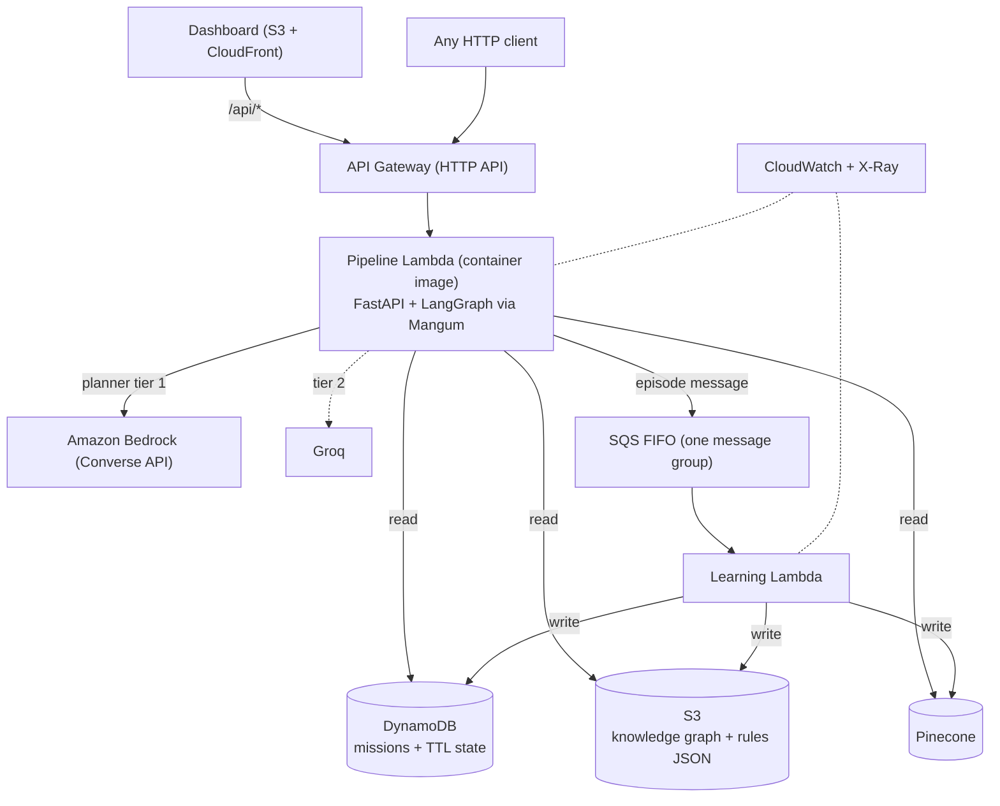

# AeroCortex → AWS Integration Spec (for Cursor)

> **Put this file at `docs/AWS_INTEGRATION_SPEC.md` in the repo, then work through it one phase at a time.**
> Do not paste the whole document into a single prompt and ask for everything at once.

## How to use this with Cursor

1. Save this file as `docs/AWS_INTEGRATION_SPEC.md`.
2. Optionally copy the block in "Appendix A" into `.cursor/rules/aws-integration.mdc` so the guardrails apply to every chat.
3. Start with this prompt:

   > @docs/AWS_INTEGRATION_SPEC.md Read the whole spec. Do **Phase 0 only**: inspect the repo, answer every question in "Facts to verify", and write a short plan. Do not write code yet.

4. Then, one phase per chat:

   > @docs/AWS_INTEGRATION_SPEC.md Implement **Phase N** exactly as specified. Run the tests and the phase's acceptance checks. Stop and summarize when done.

5. Commit after every phase. If a phase fails its acceptance checks, fix it before moving on.

---

## 1. Context

AeroCortex is a cognitive memory and recovery system for autonomous UAVs. A FastAPI service runs a LangGraph pipeline of five agents:

1. **Situation Agent**: deterministic threshold detector (no LLM).
2. **Memory Agent**: hybrid retrieval, `final = 0.6 * vector_similarity + 0.4 * graph_relevance`.
3. **Planner Agent**: LLM recovery plan. Tier order today: Groq (`llama-3.3-70b-versatile`), then Ollama, then a deterministic offline reasoner.
4. **Safety Agent**: mandatory deterministic gatekeeper. Rejected plans fall back to a deterministic procedure (VIO, RTH, emergency land).
5. **Learning Agent**: commits the episode (vector store, semantic rules, knowledge graph).

Memory layers: working memory (volatile), episodic (Pinecone primary, Chroma fallback, 64-dim cosine, index `aerocortex-episodes`), semantic IF-THEN rules, and a knowledge graph (Neo4j primary, embedded NetworkX fallback). Missions persist to MongoDB.

A static single-page dashboard (`dashboard/static`) calls the API through a same-origin `/api` path. Today Vercel rewrites `/api` to a Render deployment.

The API is currently:

| Method | Path | Auth |
|---|---|---|
| POST | `/telemetry` | `X-API-Key` |
| POST | `/simulate` | `X-API-Key` |
| GET | `/memory` | `X-API-Key` |
| GET | `/missions?limit=&skip=` | `X-API-Key` |
| GET | `/status` | `X-API-Key` |
| POST | `/reset` | `X-API-Key` |
| GET | `/healthz` | none |

## 2. Goal

Deploy AeroCortex on AWS as a serverless, event-driven system, for a hackathon submission where **architecture quality is scored**. Every AWS service must have a real job. The deployed system must behave the same as today, and the local/edge modes must keep working.

### Target architecture



**Design principle:** the safety-critical path (detect, retrieve, plan, validate) is synchronous and answers the caller immediately. Learning is asynchronous and serialized, so only one writer updates the graph and rules at a time.

### Non-goals (do NOT do these)

- No MATLAB or digital-twin integration. Do not create or touch a `matlab/` folder.
- No new failure scenarios. The existing 8 scenarios are final.
- Do not change detection thresholds, safety constraints, the 0.6/0.4 hybrid formula, or any agent's decision logic.
- Do not remove or break the MongoDB, Neo4j, Chroma, Ollama or local-file code paths. They are needed for local and Raspberry Pi use. AWS behavior is opt-in through environment variables and must default to the current behavior.
- No EC2, EKS, ECS, Step Functions, OpenSearch, Neptune, Cognito, or VPC. **Lambdas must not run in a VPC** (all dependencies are public HTTPS endpoints, and a NAT gateway costs money).
- Do not reorganize or rename existing packages.
- Do not change existing API request/response schemas. New fields must be optional and additive.

## 3. Guardrails for Cursor

- **Inspect before you write.** Read the existing code for every file you touch. Match existing names, signatures, and style. The interface sketches below are suggestions; the real names come from the repo.
- **Feature flags, not forks.** Every AWS behavior sits behind an environment variable with a default that preserves current behavior.
- **Keep the 44 existing tests green** at the end of every phase (`pytest tests -v`). Add new tests under `tests/aws/`.
- **Do not invent APIs.** For boto3, Mangum, Powertools, and SAM, follow their official documentation. If unsure, say so instead of guessing.
- **No secrets in code or in the template.** Secrets live in SSM Parameter Store.
- **Small, reviewable changes.** One phase per branch or commit.
- If something in this spec conflicts with what the code actually does, **stop and report the conflict** rather than picking silently.

## 4. Facts to verify in Phase 0 (I could not read the source)

Answer every item with file and line references before writing code.

1. Where and how are missions persisted to MongoDB, and which module and class own it? What is the shape of a stored episode, and what does `GET /missions` return?
2. How is working memory implemented (`memory/working_memory.py`)? What state does it hold, and who reads and writes it?
3. What state does the simulator hold (`simulation/mission_simulator.py`, `telemetry_generator.py`): step counter, sim clock, injected scenario? What does `POST /reset` clear?
4. How does the Learning Agent commit an episode? List every side effect (vector upsert, rule reinforcement, graph update, Mongo write) and the order. Which are idempotent and which are not (for example, edge-weight reinforcement is not)?
5. Where are the knowledge graph and semantic rules stored on disk? Where do the default seeds come from (`data/knowledge/` may be gitignored; are seeds generated in code?)? How does `knowledge_graph.py` save and load NetworkX state?
6. What is the LLM client interface (`llm/groq_client.py`)? How does `planner_agent.py` choose between tiers, validate the JSON plan, and set `planner_source`?
7. What are the exact status strings `GET /healthz` returns, and how does `dashboard/static` JS render them (colors and labels)? How is overall `status` (`ok`/`degraded`/`unavailable`) computed?
8. What request body does the dashboard send to `/simulate`, and what response shape does it read? (Use this exact shape for smoke tests.)
9. How does the dashboard learn its API base and key (`/config.json`)? What does `scripts/vercel-prepare.js` generate? What is the exact `config.json` format?
10. How do `config/config.yaml` and `config/settings.py` load configuration and env vars, and at what point? (Needed for injecting SSM secrets before settings load.)
11. Do any startup events or module-level singletons initialize heavy resources (graph load, vector client) at import time? These matter for Lambda cold starts.
12. Which dependencies in `requirements.txt` are unnecessary in the API runtime (chromadb, streamlit, dev tools)?

Write the answers into `docs/AWS_PHASE0_NOTES.md` and end with a phase-by-phase plan noting anything in this spec that needs adjusting.

## 5. Configuration contract

All new settings are environment variables. **Defaults preserve today's behavior.**

| Variable | Values (default first) | Purpose |
|---|---|---|
| `MISSION_STORE` | `mongo`, `dynamodb` | Where missions and episodes persist |
| `WORKING_MEMORY_BACKEND` | `memory`, `dynamodb` | Working memory storage |
| `SIM_STATE_BACKEND` | `memory`, `dynamodb` | Simulator state storage |
| `KNOWLEDGE_SNAPSHOT_BACKEND` | `file`, `s3` | Knowledge graph and rules persistence |
| `LEARNING_MODE` | `inline`, `async` | Commit episodes in-process, or via SQS |
| `PLANNER_TIERS` | `groq,ollama,offline` | Ordered planner tiers. AWS profile: `bedrock,groq,offline` |
| `VECTOR_FALLBACK` | `chroma`, `none` | AWS profile: `none` (Chroma is useless on ephemeral Lambda disk) |
| `BEDROCK_MODEL_ID` | unset | If unset, the Bedrock tier is skipped. **Do not hardcode a model ID.** |
| `BEDROCK_REGION` | `$AWS_REGION` | |
| `BEDROCK_TIMEOUT_S` | `8` | Per-call timeout |
| `PLANNER_TOTAL_BUDGET_S` | `20` | Total planning time across tiers (API Gateway hard limit is 30 s) |
| `MISSIONS_TABLE`, `STATE_TABLE` | | DynamoDB table names |
| `SNAPSHOT_BUCKET`, `SNAPSHOT_PREFIX` | `snapshots/` | S3 location for graph and rules JSON |
| `EPISODE_QUEUE_URL` | | SQS FIFO queue URL |
| `SSM_PREFIX` | unset | If set, load `API_KEY`, `GROQ_API_KEY`, `PINECONE_API_KEY` from SSM at cold start |
| `METRICS_ENABLED` | `false` locally, `true` on Lambda | Emit CloudWatch EMF metrics |
| `POWERTOOLS_METRICS_NAMESPACE` | `AeroCortex` | |

Add all of these (commented, with the AWS profile) to `.env.example`.

## 6. New files (create; do not restructure anything else)

```
cloud/                          # new python package: AWS adapters only
  __init__.py
  secrets.py                    # SSM loader
  factories.py                  # picks backend per env var
  dynamo_missions.py
  dynamo_state.py               # working memory + simulator state
  s3_snapshots.py               # graph + rules JSON with ETag freshness
  sqs_episodes.py               # publish episode message
llm/bedrock_client.py           # Bedrock Converse client
observability.py                # metric helper + logging setup (no-op off Lambda)
lambda_handler.py               # Mangum handler for the API Lambda
learning_handler.py             # SQS consumer for the Learning Lambda
Dockerfile.lambda               # Lambda container image
requirements-lambda.txt         # API runtime deps only
infra/
  template.yaml                 # SAM template (whole stack)
  cloudfront-strip-api.js       # CloudFront Function
scripts/deploy_dashboard.sh     # sync dashboard to S3 + invalidate
tests/aws/                      # new tests (moto, stubs)
docs/AWS_DEPLOY.md              # deploy + verify runbook
docs/AWS_PHASE0_NOTES.md       # written in Phase 0
```

## 7. Phases

### Phase 0: Recon and plan (no code)

Answer section 4. Produce `docs/AWS_PHASE0_NOTES.md`. **Acceptance:** every question answered with file references, and a concrete plan listing which existing files will be modified in each later phase.

---

### Phase 1: Lambda packaging + API Gateway (get `/healthz` live)

**Goal:** the existing FastAPI app runs on Lambda behind an HTTP API, deployed with SAM.

**Tasks**

1. `requirements-lambda.txt`: runtime deps for the API only. Exclude chromadb, streamlit and dev tools. Add `mangum`, `boto3`, `aws-lambda-powertools`, `aws-xray-sdk`. Make **chromadb import lazy and optional** in `memory/vector_store.py`, so `VECTOR_FALLBACK=none` never imports it. If Pinecone is unreachable and there is no fallback, retrieval must degrade gracefully (hybrid retrieval uses graph and rules only) instead of crashing.
2. `Dockerfile.lambda`: base `public.ecr.aws/lambda/python:3.11`, install `requirements-lambda.txt`, copy the app, `CMD ["lambda_handler.handler"]`. Build for `x86_64`.
3. `lambda_handler.py`:
   - First, `cloud.secrets.load_ssm_secrets_into_env()` if `SSM_PREFIX` is set (before importing settings or the app). Use `get_parameters` with decryption, one call, cached for the process lifetime.
   - Then `from api.telemetry_api import app` and `handler = Mangum(app, lifespan="auto")`.
   - `aws_xray_sdk.core.patch_all()` to trace boto3 calls.
4. Avoid import-time heavy work. Initialize the graph, vector client, and LLM clients lazily on first use (Phase 0 item 11).
5. `infra/template.yaml` (SAM): `HttpApi` with a `$default` stage and a catch-all route to the function, no CORS (the dashboard is same-origin), throttling defaults (rate 10, burst 20); `AWS::Serverless::Function` with `PackageType: Image`, `Architectures: [x86_64]`, `MemorySize: 2048`, `Timeout: 28`, `Tracing: Active`, and `Metadata` (`Dockerfile: Dockerfile.lambda`, `DockerContext: ..`). Environment from the section 5 table. IAM through SAM policies, least privilege, added per phase.

```yaml
Events:
  Any:
    Type: HttpApi
    Properties:
      ApiId: !Ref HttpApi
      Path: /{proxy+}
      Method: ANY
  Root:
    Type: HttpApi
    Properties:
      ApiId: !Ref HttpApi
      Path: /
      Method: ANY
```

6. Store secrets as SSM SecureString parameters under `/aerocortex/prod/` (`API_KEY`, `GROQ_API_KEY`, `PINECONE_API_KEY`). CloudFormation cannot create SecureString parameters, so document the `aws ssm put-parameter` commands in `docs/AWS_DEPLOY.md`. Grant `ssm:GetParameters` on that prefix (add `kms:Decrypt` only if needed).

**Acceptance**

- `sam validate --lint` passes; `sam build && sam deploy --guided --resolve-image-repos` succeeds in `ap-south-1` (make the region a parameter).
- `curl $API_URL/healthz` returns JSON with the same structure as today.
- One call to `/simulate` (body from Phase 0 item 8) returns a valid action. Multi-step state is *not* expected to work yet.
- `pytest tests -v` still passes locally.

---

### Phase 2: DynamoDB (missions + working memory + simulator state)

**Goal:** replace the Mongo dependency in AWS mode, and make Lambda statelessness safe.

**Tasks**

1. `cloud/dynamo_missions.py`. Suggested interface (adapt to the real one):
   `save_episode(episode) -> episode_id`, `list_episodes(limit, skip)`, `health() -> "ok"|"down"`.
2. `cloud/dynamo_state.py`: `WorkingMemoryStore` (get/put/clear by mission id) and `SimulatorStateStore` (load/save/clear). Use one item per key, a TTL attribute `expires_at` (24 h), and the simulator key `SIM#default`. `POST /reset` must delete both.
3. `cloud/factories.py`: return the right backend from `MISSION_STORE`, `WORKING_MEMORY_BACKEND`, `SIM_STATE_BACKEND`. Existing code calls the factory instead of constructing Mongo or in-memory stores directly. The default must reproduce today's behavior.
4. SAM resources:

```yaml
MissionsTable:
  Type: AWS::DynamoDB::Table
  Properties:
    BillingMode: PAY_PER_REQUEST
    AttributeDefinitions:
      - {AttributeName: mission_id, AttributeType: S}
      - {AttributeName: episode_id, AttributeType: S}
      - {AttributeName: gsi_pk, AttributeType: S}
      - {AttributeName: created_at, AttributeType: S}
    KeySchema:
      - {AttributeName: mission_id, KeyType: HASH}
      - {AttributeName: episode_id, KeyType: RANGE}
    GlobalSecondaryIndexes:
      - IndexName: by_time
        KeySchema:
          - {AttributeName: gsi_pk, KeyType: HASH}
          - {AttributeName: created_at, KeyType: RANGE}
        Projection: {ProjectionType: ALL}

StateTable:
  Type: AWS::DynamoDB::Table
  Properties:
    BillingMode: PAY_PER_REQUEST
    AttributeDefinitions: [{AttributeName: pk, AttributeType: S}]
    KeySchema: [{AttributeName: pk, KeyType: HASH}]
    TimeToLiveSpecification: {AttributeName: expires_at, Enabled: true}
```

   Every mission item carries constant `gsi_pk = "EPISODE"` so `GET /missions` queries the `by_time` index in descending order. DynamoDB has no `skip`: query with `Limit = skip + limit` and slice. That is acceptable for this scale.
5. **Idempotent writes:** saving an episode uses a conditional put (`attribute_not_exists(episode_id)`). Return a distinct result when the item already exists, because the Learning Agent must not re-apply non-idempotent side effects on a duplicate (Phase 5).
6. `/healthz`: report `dynamodb` (`ok`/`down`) using a cheap `describe_table` or a single tiny read, cached for 30 seconds. When `MISSION_STORE=dynamodb`, report `mongo: "disabled"` and **exclude it from the overall degraded computation**. Overall status must be `ok` when all *enabled* dependencies are healthy. Keep the existing key names and status vocabulary (Phase 0 item 7); add `mission_store` (`"dynamodb"` or `"mongo"`).
7. Dashboard: if `dynamodb` and `bedrock` keys exist in `/healthz`, render extra health tiles for them in the existing style; if absent, the dashboard behaves exactly as before.

**Acceptance**

- With moto: tests for save, list (paging), idempotent duplicate save, TTL attribute set, reset clears state.
- Deployed: two consecutive `/simulate` calls advance simulator state (altitude, battery and sample count evolve as they do locally); `/reset` clears it; `/missions` returns persisted episodes; `/healthz` shows `dynamodb: ok` and overall `ok` if the other dependencies are healthy.

---

### Phase 3: S3 snapshot store for the knowledge graph and rules

**Goal:** make graph and rule learning durable across Lambda invocations.

**Tasks**

1. `cloud/s3_snapshots.py`: load and save the graph (NetworkX `node_link_data` JSON) and the semantic rules JSON under `SNAPSHOT_PREFIX`. Suggested keys: `snapshots/knowledge_graph.json`, `snapshots/semantic_rules.json`.
2. **Seeding:** if the objects do not exist, seed from the packaged defaults (Phase 0 item 5) and write them. Make sure the Lambda image contains those defaults (they may be generated in code; do not assume `data/` is copied).
3. **Freshness:** the API Lambda is read-only. Cache the loaded graph in the process, and on each request do a cheap `head_object`, comparing ETag; reload only if it changed. Limit checks to at most one per 5 seconds per instance.
4. **Writes only from the Learning path** (inline mode locally, Learning Lambda on AWS). Use `put_object`; the single-message-group FIFO in Phase 5 serializes writers.
5. Wire it through `KNOWLEDGE_SNAPSHOT_BACKEND=file|s3` in the existing `knowledge_graph.py` and `semantic_memory.py` persistence points. The default `file` must be byte-for-byte the current behavior.
6. SAM: a private S3 bucket (`SnapshotBucket`) with public access blocked, default encryption, and versioning enabled (a free undo for corrupted learning).

**Acceptance**

- moto tests: seed on first load, ETag-based refresh, save then load round trip preserves nodes and edges.
- Deployed: `/memory` shows non-zero rules, KG nodes, and KG edges (about 9 rules, 24 nodes, 21 edges on a fresh seed, per the existing demo). Health `engine` still reports `NetworkX Embedded`.

---

### Phase 4: Bedrock planner tier

**Goal:** add Amazon Bedrock as the top planner tier without changing planner semantics.

**Tasks**

1. `llm/bedrock_client.py`: use `boto3` `bedrock-runtime` and the **Converse API**. Mirror the interface of `llm/groq_client.py` exactly, including the prompt construction and plan JSON parsing, so the planner can treat all tiers the same. Set a low temperature (about 0.2) and a bounded max-token count. Enforce `BEDROCK_TIMEOUT_S` through the botocore config (connect and read timeouts, retries off or minimal).
2. `planner_agent.py`: build the tier list from `PLANNER_TIERS`. Skip `bedrock` if `BEDROCK_MODEL_ID` is unset. Each tier failure (timeout, throttle, access denied, unparsable JSON, schema violation) falls through to the next tier. **Enforce `PLANNER_TOTAL_BUDGET_S` across tiers.** Set `planner_source` to `"bedrock"` when it wins. The Safety Agent still validates every plan regardless of tier. Do not weaken it.
3. `/healthz`: add `bedrock`: `"ok"` if configured and the last real call did not fail, `"down"` if the last call failed, and omit or `"unconfigured"` otherwise. **Never invoke a model from `/healthz`** (the dashboard polls it and Bedrock bills per token).
4. SAM: give the function `bedrock:InvokeModel` (the Converse API is authorized by this permission). Start with `Resource: "*"` scoped by action, and add a `TODO` to tighten to the specific model and inference-profile ARNs. Cross-region inference profiles can require permission on both the profile and the underlying foundation models.
5. Model choice is a **manual prerequisite**: the person deploying must enable model access in the Bedrock console for their region and set `BEDROCK_MODEL_ID`. Document this in `docs/AWS_DEPLOY.md`. Do not pick a model in code.

**Acceptance**

- Unit tests with botocore `Stubber`: success path sets `planner_source == "bedrock"`; throttling, access denied, timeout, and invalid JSON each fall through to the next tier; the total time budget is respected.
- Deployed (once model access is enabled): `/simulate` with GPS interference shows `planner_source: "bedrock"`, a valid plan, and a Safety verdict. If Bedrock is disabled, the same call shows `groq`. Both work.

---

### Phase 5: Asynchronous learning (SQS FIFO + Learning Lambda)

**Goal:** split the Learning Agent so the response returns without waiting for consolidation, and learning writes are serialized.

**Tasks**

1. `LEARNING_MODE=inline` (default) keeps today's behavior. `LEARNING_MODE=async` changes only the **Learning node's delivery**: the node builds an episode payload (everything the existing commit needs, JSON-serializable; trim large retrieval context to stay well under the 256 KB SQS limit), generates the `episode_id` (UUID) now, publishes to SQS, and returns a result marking it as queued.
2. `cloud/sqs_episodes.py`: `send_message` to the FIFO queue with `MessageGroupId="aerocortex"` and `MessageDeduplicationId=episode_id`.
3. The API response and orchestration logs keep their current shape. In async mode the log line reads `Experience queued: <episode_id>` (inline mode still logs `Experience committed: <uuid>`). Any existing `persisted` field is preserved; add an optional `learning_mode` field.
4. `learning_handler.py`: SQS event handler. For each record, deserialize the payload and call the **same** commit function the inline path uses. It logs `Experience committed: <episode_id>`. Use partial batch responses (`batchItemFailures`).
5. **Idempotency (required):** SQS is at-least-once. Persist the episode with the conditional put from Phase 2 first. If the item already exists, skip every non-idempotent side effect (graph and rule reinforcement) and report success. Vector upserts use `id = episode_id`, so they are idempotent already.
6. SAM:

```yaml
EpisodeDLQ:
  Type: AWS::SQS::Queue
  Properties:
    FifoQueue: true
    QueueName: !Sub "${AWS::StackName}-episodes-dlq.fifo"
    MessageRetentionPeriod: 1209600

EpisodeQueue:
  Type: AWS::SQS::Queue
  Properties:
    FifoQueue: true
    ContentBasedDeduplication: false
    QueueName: !Sub "${AWS::StackName}-episodes.fifo"
    VisibilityTimeout: 180        # >= 6x the Learning Lambda timeout
    RedrivePolicy:
      deadLetterTargetArn: !GetAtt EpisodeDLQ.Arn
      maxReceiveCount: 3

LearningFunction:
  Type: AWS::Serverless::Function
  Properties:
    PackageType: Image
    Architectures: [x86_64]
    MemorySize: 1024
    Timeout: 30
    Tracing: Active
    ImageConfig:
      Command: ["learning_handler.handler"]
    Events:
      Episodes:
        Type: SQS
        Properties:
          Queue: !GetAtt EpisodeQueue.Arn
          BatchSize: 1
          FunctionResponseTypes: [ReportBatchItemFailures]
```

   The Learning Lambda reuses the same image (different `Command`). Give it DynamoDB write, S3 read and write on the snapshot prefix, and SSM read. Give the API function only `sqs:SendMessage`. Add an alarm on DLQ depth greater than 0.

**Acceptance**

- moto tests: publish, then consume, and the episode ends up in the mission store; delivering the same message twice applies reinforcement once; a poison message lands in the DLQ after 3 tries.
- Deployed: `/simulate` returns quickly with `Experience queued`; within a few seconds `/missions` shows the episode, `/memory` counters increase, and CloudWatch shows the Learning Lambda's `Experience committed` line. A second `/simulate` call retrieves the first episode in hybrid memory. Note that Pinecone is eventually consistent, so allow a few seconds and document this.

---

### Phase 6: Dashboard on S3 + CloudFront (same-origin `/api`)

**Goal:** serve the dashboard from AWS and reproduce the Vercel rewrite.

**Tasks**

1. SAM: a private dashboard bucket; a CloudFront distribution with Origin Access Control to that bucket (default root object `index.html`); a second origin for the HTTP API domain (`<api-id>.execute-api.<region>.amazonaws.com`, HTTPS only).
2. Behavior `/api/*` to the API origin: caching **disabled** (managed policy `CachingDisabled`), origin request policy that forwards all viewer headers except Host (managed `AllViewerExceptHostHeader`, so `X-API-Key` reaches the API), all HTTP methods allowed, and a viewer-request **CloudFront Function** that strips the `/api` prefix. Verify managed policy IDs in the AWS docs rather than trusting memory.

```js
// infra/cloudfront-strip-api.js
function handler(event) {
  var request = event.request;
  request.uri = request.uri.replace(/^\/api(\/|$)/, '/');
  return request;
}
```

3. `scripts/deploy_dashboard.sh`: `aws s3 sync dashboard/static s3://$DASHBOARD_BUCKET --delete`, then generate `config.json` in **exactly** the format the dashboard expects (Phase 0 item 9) with API base `/api`, then invalidate `/config.json` and `/index.html` (or `/*`). Give `config.json` a short cache TTL.
4. Output the CloudFront URL as a stack output.

**Known trade-off (document it in `docs/AWS_DEPLOY.md`):** if the API key is written into `config.json`, it is publicly readable. That matches today's Vercel setup and is acceptable for a demo, but the API's throttling then protects Groq and Bedrock spend. An optional hardening is a CloudFront origin custom header carrying the key so the browser never sees it; verify the header-override behavior in the docs before relying on it, and note that this makes the CloudFront URL an open demo endpoint.

**Acceptance**

- `https://<cloudfront-domain>/` loads the dashboard; the health strip fills in; **Step Mission** works end to end with the API base `/api`; browser dev tools show no cross-origin requests and no CORS errors.
- `GET https://<cloudfront-domain>/api/healthz` matches `GET <api-url>/healthz`.

---

### Phase 7: Observability

**Goal:** make the black-box recorder real in CloudWatch and X-Ray.

**Tasks**

1. `observability.py`: structured JSON logging (Powertools `Logger`), and `emit_metric(name, value, unit, **dimensions)` built on Powertools `single_metric` (EMF, no API calls). It must be a **no-op** when `METRICS_ENABLED` is not `true`, so local runs and tests are unaffected.
2. Emit metrics from the existing agent boundaries without altering logic (namespace `AeroCortex`):
   - `PipelineLatencyMs` (whole run)
   - `AnomaliesDetected` (dimension `FailureType`)
   - `SafetyRejections` (dimension `FailureType`)
   - `PlannerSource` count (dimension `Source`: bedrock, groq, offline)
   - `RetrievedEpisodes` (count of past experiences retrieved)
   - `EpisodesCommitted` (from the Learning Lambda)
3. Log each orchestration stage as one structured line carrying the mission id and (when available) the episode id. Keep the existing human-readable orchestration log messages that the dashboard displays.
4. SAM: a CloudWatch Dashboard (`AWS::CloudWatch::Dashboard`) with widgets for Lambda invocations, errors, and duration; the custom metrics above; DLQ depth; and API Gateway 4xx/5xx. Alarms for Lambda errors and DLQ depth greater than 0. Set log retention (14 days) on both function log groups.
5. Active tracing is already enabled. Confirm the X-Ray service map shows API Gateway, Lambda, Bedrock (or Groq call), SQS, Learning Lambda, DynamoDB and S3.

**Acceptance**

- After a few `/simulate` calls, custom metrics appear in CloudWatch, the dashboard widgets populate, and an X-Ray trace shows the API Lambda and its downstream calls. Tests confirm `emit_metric` is a no-op by default.

---

### Phase 8: Docs, deploy runbook, final verification

1. `docs/AWS_DEPLOY.md`: prerequisites (AWS CLI, SAM CLI, Docker, Python 3.11); one-time setup (SSM parameters, Bedrock model access, a low AWS Budgets alert); deploy commands (`sam build`, `sam deploy --guided --resolve-image-repos`); dashboard deploy; teardown (`sam delete`, and empty buckets first); troubleshooting (cold start, throttling, Bedrock access denied, DLQ inspection); and the environment variable table.
2. Update `README.md` with a short "Deploy on AWS" section that links to it and includes the architecture diagram.
3. Run the definition-of-done checklist below.

## 8. Definition of done

- [ ] `pytest tests -v` passes (all existing tests plus `tests/aws/`).
- [ ] `sam validate --lint` passes; `sam deploy` from a clean checkout creates the whole stack.
- [ ] `GET /healthz` (through CloudFront) shows `dynamodb: ok`, the vector engine, the graph engine, `groq: ok`, and `bedrock: ok` if enabled. Overall status is `ok` when every enabled dependency is healthy. `mongo` reads `disabled` and does not degrade the status.
- [ ] Dashboard on CloudFront: Step Mission, second Step, and Reset all work for the GPS_INTERFERENCE scenario. The memory table shows the first step's episode on the second step; Episodes counter increases.
- [ ] All 8 existing failure scenarios still run and produce Safety-validated actions on AWS.
- [ ] `planner_source` shows `bedrock` when enabled, and falls back to `groq` or `offline` when Bedrock is disabled or fails, with no user-visible error.
- [ ] Learning is asynchronous: response returns immediately with `Experience queued`, and the Learning Lambda commits within seconds; duplicate SQS deliveries do not double-reinforce rules.
- [ ] Local mode still works with no AWS env vars set (`python main.py --api`, `docker compose up`, `python demo.py`).
- [ ] No secrets committed. No Lambda runs in a VPC.
- [ ] An X-Ray service map and a CloudWatch dashboard exist and populate.

## 9. Known risks (handle, do not ignore)

- **Cold starts** on a container image with LangGraph and NumPy can take several seconds. Keep imports lazy; document a pre-demo warm-up call; consider provisioned concurrency of 1 only for demo day (it costs money).
- **Eventual consistency** of Pinecone upserts and of async learning means a second step fired instantly may not see the first episode. Document it; do not mask it in tests.
- **Single simulator session.** Simulator state is keyed `SIM#default`, so concurrent users share it. This is acceptable for the demo. An optional `X-Session-Id` header can scope it later.
- **API Gateway's 30 s limit.** Planner tier timeouts plus the total budget must keep the worst case under it.
- **Spend.** Throttle the API, set an AWS Budgets alert, and keep Bedrock `max_tokens` bounded.

---

## Appendix A: `.cursor/rules/aws-integration.mdc` (optional)

```
---
description: AeroCortex AWS integration guardrails
alwaysApply: false
globs: ["cloud/**", "infra/**", "lambda_handler.py", "learning_handler.py", "llm/bedrock_client.py", "observability.py", "tests/aws/**"]
---
- Follow docs/AWS_INTEGRATION_SPEC.md. Work on one phase at a time and stop after each phase.
- Every AWS behavior is opt-in via environment variables; defaults must preserve current local behavior.
- Do not change agent decision logic, detection thresholds, safety constraints, the 0.6/0.4 hybrid formula, or the 8 failure scenarios.
- Do not remove Mongo, Neo4j, Chroma, Ollama, or local-file code paths.
- No VPC, no EC2, no MATLAB/digital-twin work, no new AWS services beyond the spec.
- Keep existing API schemas; only add optional fields.
- Never hardcode secrets or a Bedrock model ID. Never call a model from /healthz.
- Inspect existing code and match its names and style before writing. If the code contradicts the spec, stop and report.
- Run pytest tests -v and the phase acceptance checks before declaring a phase done.
```
